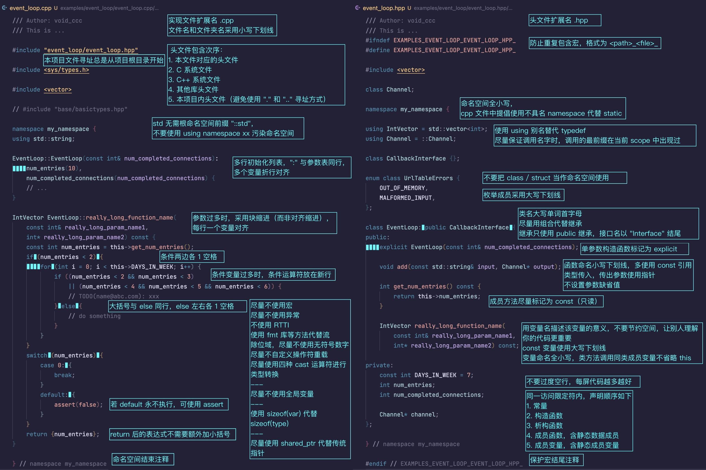

[本仓库](https://github.com/SJTU-RoboMaster-Team/style-team)代码规范的参考主要是 [Chromium C++ style guide](http://chromium.googlesource.com/chromium/src/+/HEAD/styleguide/c++/c++.md)，[Google 开源项目风格指南](https://zh-google-styleguide.readthedocs.io/en/latest/google-cpp-styleguide/)和 [Rust style guide](https://github.com/rust-lang/style-team)。翻译规范遵循 Rust 中文翻译项目组的 [Rust 文档翻译指引](https://rustwiki.org/wiki/translate/rust-translation-guide/)和 [Rust 语言术语中英文对照表](https://rustwiki.org/wiki/translate/english-chinese-glossary-of-rust/)。

# 代码规范 RFCs

本仓库用于讨论和确定 C++ 的代码规范，使用 Clang-Format 和 Clang-Tidy 来自动化执行风格修正。你可以在 `text` 文件夹中提交意见，并且为格式化工具提供规范。

## 风格指南如何征求意见

* 若要讨论风格规则，请你发起 GitHub issue。你需要注意：
  - 精确定义你的规则，给出详尽的解释和例子。
  - 你得看看有无现存的 issue 和规则已经涵盖了你的主题。
  - 风格团队会关闭无休止的 issue，除非 issue 给出了新的理由或者新的方案。
* 讨论出结果的 issue 会被放入 final comment period (FCP)。
* 达成共识！

## 如何实践这些风格

使用自动化插件 Clang-Format 和 Clang-Tidy 读取本项目中的 `.clang-format` 和 `.clang-tidy` 即可。

在简单编辑环境下，你仍然可以比较轻松地践行这些规则。

## 设计原则

在设计风格指南时，风格团队试图遵循以下原则（大致按优先顺序排列）：

* 可读性 🐰
  - 阅读速度
  - 防止误导
  - 可访问性 - 适用于不同硬件环境下，包括非可视化环境
  - 在编译器报错信息中的可读性

* 美学 🏛
  - sense of beauty
  - 与现代编程语言保持一致

* 细节 🖋
  - 易于进行版本维护
  - 尽可能兼容未来代码
  - 增加代码密集度，防止右飘

* 应用 👶🏻
  - 规则易于手动实践（在最简编辑环境中）
  - 规则易于自动实践（当可以使用 Clang-format 等其他工具时）
  - 规则的一致性
  - 保持风格规则的简并性

## [C++ 代码风格指南](guide.md)
